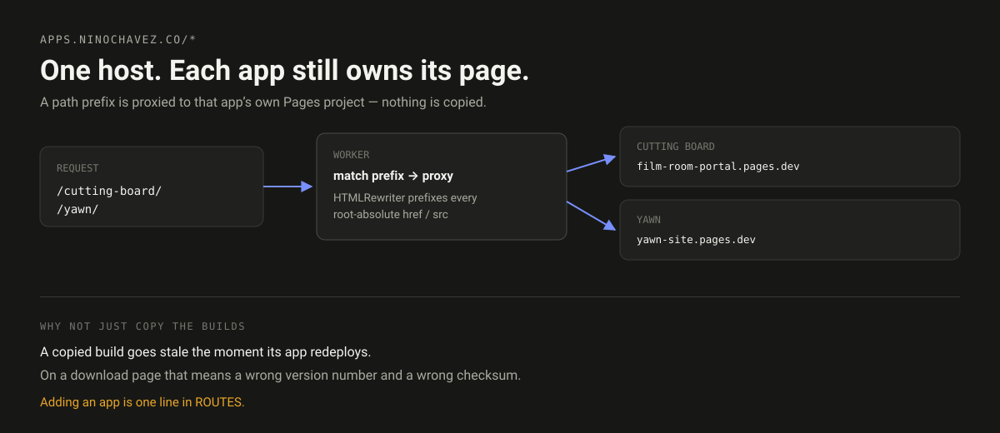

# apps-ninochavez-router

A Cloudflare Worker that puts several apps on one host without copying any of
them. It matches a path prefix, proxies to that app's own Pages project, and
rewrites root-absolute links so the app's assets resolve under the prefix.

```
apps.ninochavez.co/cutting-board/  →  private-beta-kit.film-room-portal.pages.dev
apps.ninochavez.co/yawn/           →  yawn-site.pages.dev
apps.ninochavez.co/                →  apps-ninochavez-git.pages.dev
```

## Why not just copy the builds into one project

That was the first attempt, and it works until an app redeploys. Then the copy
is a snapshot of an older release — and on a download page, a stale snapshot
means a **wrong version number and a wrong checksum** next to a real download
button. Nothing warns you; the page still renders.

Proxying removes the failure mode rather than scheduling a chore to avoid it.
Each app stays the single source of its own page.

## Adding an app

One line:

```js
const ROUTES = {
  '/cutting-board': 'https://private-beta-kit.film-room-portal.pages.dev',
  '/yawn':          'https://yawn-site.pages.dev',
  '/next-app':      'https://next-app.pages.dev',   // ← here
};
```

```bash
npx wrangler deploy
```

## The link rewriting, and why it is needed

An app page built for its own origin asks for `/_astro/app.css`. Served under a
prefix, that request lands at `apps.ninochavez.co/_astro/app.css` — the index
project, which has no such file.

So HTML responses pass through `HTMLRewriter`, which prefixes any root-absolute
`href`, `src`, `action`, `poster`, and `srcset`. Protocol-relative, external,
anchor, and `data:` URLs are left alone.

Everything that is not HTML streams straight through untouched, so images, CSS,
and downloads are not parsed or buffered.

## Requirements an app page must meet

- Absolute or relative internal links. Both work.
- No hard-coded absolute URLs back to its own `pages.dev` hostname — those
  bypass the prefix and leave the visitor on the bare project domain.
- Assets served from the same project. Cross-origin assets are unaffected either
  way.

## Deploy

```bash
npx wrangler deploy      # takes the route in wrangler.jsonc
npx wrangler tail        # watch live requests
```

The route is `apps.ninochavez.co/*` on zone `ninochavez.co`. A Worker route wins
over a Pages custom domain on the same hostname, which is what lets the index
project keep serving `/` while the Worker owns the paths.

## License

MIT.
